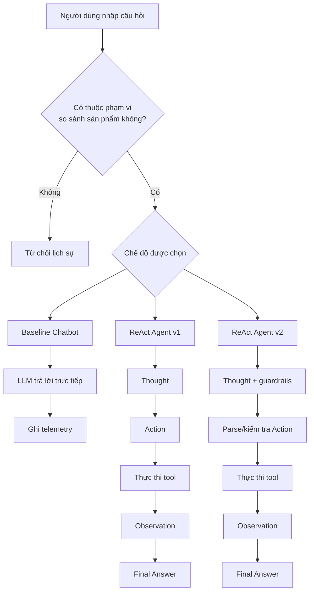

# Báo cáo Nhóm: Lab 3 - Hệ thống Agentic đạt mức Production

- **Tên nhóm**: `E403-32 Product Comparison Assistant`
- **Thành viên nhóm**: `[Cập nhật đầy đủ họ tên thành viên]`
- **Ngày triển khai**: `2026-04-06`

---

## 1. Tóm tắt điều hành

Mục tiêu của nhóm là xây dựng một **trợ lý mua sắm theo miền bài toán cụ thể** có thể tìm kiếm sản phẩm, so sánh điện thoại/laptop và tính toán giá bằng vòng lặp ReAct kết hợp telemetry. Hệ thống cuối cùng gồm ba chế độ: chatbot baseline, `ReAct Agent v1`, `ReAct Agent v2`, cùng với giao diện demo bằng `Streamlit`.

- **Tỷ lệ thành công**: Dựa trên đánh giá thủ công từ `6` truy vấn benchmark trong `logs/comparison_results.json`, chatbot baseline chỉ cho ra câu trả lời bám dữ liệu khoảng **2/6** trường hợp, trong khi `Agent v1` và `Agent v2` xử lý đúng **6/6** câu hỏi sản phẩm nhờ sử dụng tool.
- **Kết quả nổi bật**: Hai phiên bản agent vượt trội so với baseline ở các câu hỏi nhiều bước vì chúng gọi đúng `product_search`, `product_compare`, `price_calculator` và `calculator` thay vì chỉ dựa vào trí nhớ của mô hình ngôn ngữ.

---

## 2. Kiến trúc hệ thống & công cụ

### 2.1 Cài đặt vòng lặp ReAct
Hệ thống tuân theo mẫu chuẩn **Thought → Action → Observation → Final Answer**. Trong đó `Agent v2` là bản nâng cấp của `v1`, bổ sung khả năng parse tốt hơn, kiểm tra hallucination, retry logic và bộ lọc câu hỏi ngoài phạm vi.

### 2.2 Danh sách công cụ (Inventory)
| Tên tool | Định dạng input | Mục đích sử dụng |
| :--- | :--- | :--- |
| `product_search` | `string` | Tìm điện thoại/laptop theo tên hoặc theo loại từ cơ sở dữ liệu sản phẩm cục bộ. |
| `product_compare` | `string` (`product1 vs product2`) | So sánh hai sản phẩm theo giá và thông số kỹ thuật. |
| `price_calculator` | `string` | Tính giảm giá, đổi VND→USD hoặc tính biểu thức liên quan đến giá. |
| `calculator` | `string` | Tính các biểu thức toán học đơn giản như `29990000 - 27990000`. |

### 2.3 Các LLM provider được sử dụng
- **Chính**: `OpenAI gpt-4o` cho lần benchmark được ghi trong `logs/2026-04-06.log`
- **Phụ (backup)**: `Gemini 1.5 Flash` thông qua lớp provider interface
- **Tùy chọn local**: `llama-cpp-python` + mô hình GGUF chạy CPU

---

## 3. Telemetry & bảng điều khiển hiệu năng

Lần chạy so sánh cuối (`python main.py --compare`) đã được ghi trong `logs/2026-04-06.log`. Từ 6 benchmark task, nhóm thu được các chỉ số sau:

| Chế độ | P50 Latency | Max Latency (xấp xỉ P99) | Token trung bình / task | Tổng chi phí ước tính |
| :--- | ---: | ---: | ---: | ---: |
| `chatbot` | `2205 ms` | `4957 ms` | `259` | `$0.0155` |
| `agent_v1` | `3910 ms` | `6197 ms` | `1563.33` | `$0.0938` |
| `agent_v2` | `2780 ms` | `4683 ms` | `1979` | `$0.1187` |

- **Độ trễ trung bình (P50)**: `2780 ms` cho ứng viên production cuối cùng là `Agent v2`
- **Độ trễ cực đại (P99 xấp xỉ trên 6 task)**: `4683 ms` cho `Agent v2`
- **Token trung bình mỗi task**: `1979` cho `Agent v2`
- **Tổng chi phí test suite**: `$0.1187` cho `Agent v2`; `$0.0155` cho baseline

**Nhận xét:** agent tốn token hơn và chậm hơn baseline, nhưng đổi lại có khả năng reasoning mạnh hơn, dùng tool bám dữ liệu tốt hơn và trả lời đáng tin cậy hơn ở các câu hỏi nhiều bước.

---

## 4. Phân tích nguyên nhân gốc rễ (RCA) - các failure trace

### Case Study: Parse Error và trả lời ngoài phạm vi
- **Đầu vào**: các câu chào hỏi / câu hỏi không liên quan như `"hi"` và `"tình hình chiến sự ở Iran hiện tại"`
- **Quan sát**: Các trace trước đó trong `logs/2026-04-06.log` xuất hiện `AGENT_V2_PARSE_ERROR` khi mô hình trả lời theo kiểu hội thoại thay vì tuân thủ đúng format `Action: tool_name(argument)`. Chatbot baseline cũng có xu hướng trả lời các câu hỏi thời sự/thời tiết thay vì từ chối.
- **Nguyên nhân gốc rễ**: Prompt ban đầu còn quá chung chung và chưa có ranh giới miền bài toán rõ ràng. Vì vậy mô hình dễ quay về hành vi chatbot thông thường thay vì chỉ tập trung vào sản phẩm và tool.
- **Cách khắc phục**:
  1. Siết chặt system prompt cho cả hai agent và baseline chatbot
  2. Thêm retry/guardrail logic vào `agent_v2.py`
  3. Tạo `src/core/scope_guard.py` để chặn câu hỏi ngoài phạm vi trước khi gọi LLM
  4. Bổ sung regression test trong `tests/test_scope_guard.py`

**Kết quả:** các đầu vào không liên quan hiện được từ chối ngay bằng một phản hồi lịch sự, giúp giảm lãng phí token và tránh trả lời sai chủ đề.

---

## 5. Thí nghiệm và ablation study

### Thí nghiệm 1: Prompt v1 so với Prompt v2
- **Khác biệt**:
  - `v2` thêm few-shot examples
  - cải thiện regex để parse action
  - thêm guardrail cho tool không tồn tại
  - thêm retry logic khi parse lỗi
- **Kết quả**: `v2` thường chọn đường đi tool ngắn gọn hơn. Ví dụ với câu hỏi *"MacBook Air M2 và Dell XPS 13 cái nào rẻ hơn bao nhiêu tiền?"*, `v1` dùng **4 bước** trong khi `v2` hoàn thành chỉ với **3 bước** bằng cách dùng `product_compare` rồi `calculator`.

### Thí nghiệm 2 (Bonus): Chatbot so với Agent
| Tình huống | Kết quả Chatbot | Kết quả Agent | Bên tốt hơn |
| :--- | :--- | :--- | :--- |
| `iPhone 15 có những thông số gì?` | Trả lời chung chung từ trí nhớ mô hình | Trả lời bám dữ liệu từ `product_search` | **Agent** |
| `Tìm cho tôi các laptop có sẵn` | Gợi ý website mua sắm | Trả về đúng danh sách laptop trong database | **Agent** |
| `So sánh iPhone 15 và Samsung Galaxy S24` | So sánh suy đoán / không grounding | So sánh có cấu trúc bằng tool | **Agent** |
| `iPhone 15 Pro Max giảm giá 20%` | Chỉ nêu công thức tính | Tính ra giá giảm chính xác | **Agent** |
| Câu chào đơn giản | Ổn | Ổn sau khi cải thiện prompt | Hòa |

---

## 6. Đánh giá mức sẵn sàng production

Prototype hiện tại đã có một số yếu tố gần với môi trường production, nhưng vẫn cần được tăng cường thêm trước khi triển khai thực tế.

- **Bảo mật**:
  - chuẩn hóa / sanitize input trước khi đưa vào tool
  - giới hạn các phép tính an toàn trong calculator
  - giữ API key trong `.env`, không đưa vào source code
- **Guardrails**:
  - `max_steps` để tránh loop vô hạn và tăng chi phí
  - `scope_guard.py` để từ chối truy vấn ngoài phạm vi
  - retry logic + hallucination detection trong `Agent v2`
- **Khả năng mở rộng**:
  - thay cơ sở dữ liệu sản phẩm cục bộ bằng API hoặc database thực
  - thêm cache / async cho tool call để UI phản hồi nhanh hơn
  - nếu số lượng tool tăng, có thể chuyển sang `LangGraph` hoặc kiến trúc supervisor/multi-agent

---

## 7. Khai báo việc sử dụng AI hỗ trợ

Trong quá trình làm bài, nhóm có sử dụng **AI/LLM** ở hai mức độ:

### 7.1 AI là thành phần của hệ thống
- `OpenAI gpt-4o` và `Gemini` được dùng làm **mô hình ngôn ngữ trung tâm** cho chatbot baseline và hai phiên bản ReAct agent.
- LLM chịu trách nhiệm sinh `Thought`, chọn `Action`, tổng hợp `Observation` và đưa ra `Final Answer`.

### 7.2 AI hỗ trợ quá trình phát triển
- AI được dùng để **gợi ý ý tưởng**, rà soát prompt, hỗ trợ refactor code, giải thích lỗi và hỗ trợ diễn đạt một phần tài liệu/report.
- Tuy nhiên, **việc thiết kế tool, kiểm thử, đọc log, sửa lỗi, đánh giá kết quả và quyết định cuối cùng** đều do nhóm chủ động thực hiện và kiểm chứng lại bằng test / log thực tế.

### 7.3 Mức độ kiểm soát của nhóm
- Nhóm không sao chép nguyên xi đầu ra từ AI mà luôn chỉnh sửa lại để phù hợp với yêu cầu môn học và mã nguồn hiện tại.
- Mọi số liệu trong báo cáo (latency, token, cost, success rate) đều được lấy từ file log và kiểm chứng lại bằng lệnh chạy thực tế.
